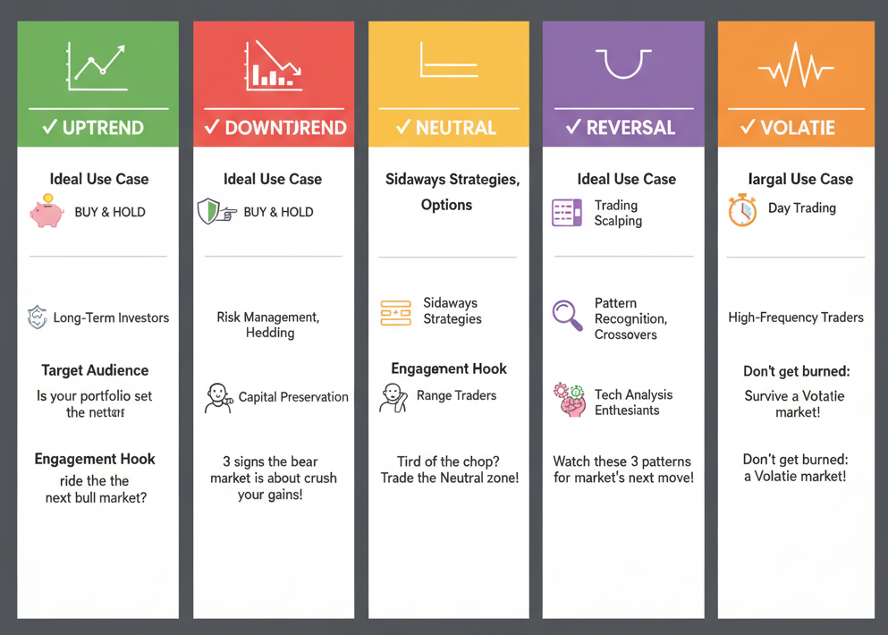

# 📈 Markov Chain Market Regime Modelling

> **A data-driven, probabilistic approach to predicting stock market behaviour — built as part of an MBA learning project.**
>
> 🔗 Read the full article on Medium → [Modelling Stock Market Regimes with Markov Chains](https://medium.com/insiderfinance/modelling-stock-market-regimes-with-markov-chains-a-practical-data-driven-study-712d98300ccf)

---

## What this project does

Instead of predicting *prices* (which is noisy and unreliable), this project predicts *market behaviour* — the regime a stock is in. The core insight is:

> **Given today's market mood, what is the probability of tomorrow's market mood?**

That is exactly what a Markov chain answers. The model achieved **62% next-day regime prediction accuracy** on Sun Pharmaceutical (SUNPHARMA.NS) — meaningfully above the 55–60% baseline considered significant in probabilistic regime modelling.

---

## The six market regimes

| Regime | What it means | Typical strategy |
|---|---|---|
| **Uptrend** | Positive momentum, price above MA20 | Buy & Hold |
| **Downtrend** | Negative momentum, price below MA20 | Risk management, hedging |
| **Neutral** | Sideways consolidation — the gravitational centre | Sideway / options strategies |
| **Reversal** | Strong move that contradicts the current trend | Pattern recognition, scalping |
| **Volatile** | Very large intraday range, high ATR | Day trading, tight stops |
| **Calm** | Unusually low volatility, near-flat movement | Range trading |

---

## How it works — the pipeline

```
Raw OHLCV Data
      │
      ▼
Feature Engineering
(ATR, MA20, Pct_Change, Vol_Ratio)
      │
      ▼
Regime Classification
(Rule-based: 6 states)
      │
      ▼
Markov Transition Matrix
(Count transitions → normalise rows)
      │
      ▼
Backtest  ──────────────────► Trading Signals
(argmax prediction)           (BUY / SELL / HOLD / BUY-the-DIP)
      │
      ▼
N-Step Forward Forecast
(5-day probability distribution)
```

---

## Key results (SUNPHARMA.NS, 24 months)

**Transition probability matrix:**

| From → To | Downtrend | Neutral | Reversal | Uptrend | Volatile |
|---|---|---|---|---|---|
| **Downtrend** | 22.9% | **45.7%** | 8.6% | 20.0% | 2.9% |
| **Neutral** | 9.2% | **52.0%** | 8.7% | 27.2% | 2.9% |
| **Reversal** | 15.2% | **36.4%** | 9.1% | 27.3% | 12.1% |
| **Uptrend** | 6.1% | **47.5%** | 10.1% | 35.4% | 1.0% |
| **Volatile** | 0.0% | 4.6% | 1.3% | 1.3% | **92.7%** |

**Key insights:**
- **Neutral is the gravitational centre** — most states revert to it
- **Volatile is extremely sticky** at 92.7% self-transition — once a stock enters a volatile period, it tends to stay there
- **Downtrends rarely persist** — less than 23% chance of a downtrend following a downtrend
- **62% backtest accuracy** — a meaningful probabilistic edge when applied consistently

---

## Visualisations produced

The script generates seven interactive Plotly charts:

1. **Regime timeline** — scatter plot of daily regime labels across the full date range
2. **Transition matrix heatmap** — visual representation of state-to-state probabilities
3. **Backtest dashboard** (3-panel):
   - Risk gauge: combined P(Reversal) + P(Volatile) over time
   - Top-1 / Top-2 prediction probabilities
   - Predicted vs actual state timeline
4. **Confusion matrix** — where the model predicts correctly and where it fails
5. **State duration distribution** — box plot of how long each regime typically lasts
6. **N-day forward forecast** — 5-day probability distribution from the last known state
7. **Confidence vs accuracy** — whether higher prediction confidence correlates with being correct

---

## Getting started

### 1. Clone the repository

```bash
git clone https://github.com/YOUR_USERNAME/markov-market-regimes.git
cd markov-market-regimes
```

### 2. Install dependencies

```bash
pip install -r requirements.txt
```

### 3. Run the model

```bash
python markov_market_regimes.py
```

That's it. The script will download live data from Yahoo Finance, run the full pipeline, and open all seven charts in your browser.

### 4. Change the stock or parameters

Open `markov_market_regimes.py` and edit the `CONFIG` section at the top:

```python
TICKER          = "SUNPHARMA.NS"   # ← any Yahoo Finance ticker
PERIOD          = "24mo"           # ← lookback period
BACKTEST_FROM   = "2025-01-01"     # ← start date for backtesting
ATR_PERIOD      = 14               # ← ATR smoothing window
MA_PERIOD       = 20               # ← moving average window
N_FORECAST_DAYS = 5                # ← days ahead to forecast
```

Examples of valid tickers: `RELIANCE.NS`, `TCS.NS`, `INFY.NS`, `AAPL`, `TSLA`, `^NSEI`

---

## Requirements

```
yfinance>=0.2.18
pandas>=2.0.0
numpy>=1.24.0
plotly>=5.18.0
scikit-learn>=1.3.0
```

Install with:
```bash
pip install -r requirements.txt
```

---

## Project structure

```
markov-market-regimes/
│
├── markov_market_regimes.py   ← main script (all logic in one file)
├── requirements.txt           ← Python dependencies
└── README.md                  ← this file
```

---

## Theory — why Markov chains work here

A **Markov chain** is a system where the probability of transitioning to the next state depends only on the *current* state, not on any prior history. Formally:

```
P(State_t+1 | State_t, State_t-1, ...) = P(State_t+1 | State_t)
```

For stock markets, this is a reasonable approximation at the regime level — even if individual price movements are noisy, regime persistence (e.g. volatile periods clustering) is a well-documented phenomenon. The Markov chain captures this persistence in the transition matrix's diagonal values.

The **ATR (Average True Range)** is computed using an Exponential Weighted Mean rather than a simple rolling average, making it more responsive to sudden volatility spikes without being excessively noisy:

```
TR  = max(High−Low, |High−PrevClose|, |Low−PrevClose|)
ATR = TR.ewm(span=14).mean()
```

---

## Limitations

- The model predicts **regimes, not price direction or magnitude**
- The transition matrix is estimated from historical data — it will drift as market conditions change; periodic retraining is recommended
- The 62% accuracy is measured on a single stock over a specific time window; results will vary across tickers and market cycles
- The rule-based regime classifier uses fixed thresholds that may need tuning for different stocks or asset classes

---

## What's next (Part 2)

- Extending to multiple stocks simultaneously
- Adding Hidden Markov Models (HMM) for unsupervised regime detection
- Combining Markov signals with a momentum or mean-reversion strategy
- Walk-forward optimisation of classifier thresholds

---

## Author

**Channabasava H** — MBA student, quantitative finance enthusiast

- 📄 [Medium article](https://medium.com/insiderfinance/modelling-stock-market-regimes-with-markov-chains-a-practical-data-driven-study-712d98300ccf)
- Published in [InsiderFinance Wire](https://medium.com/insiderfinance)

---

## Disclaimer

This project is for **educational purposes only**. Nothing here constitutes financial advice. Always do your own research before making any investment decisions.
